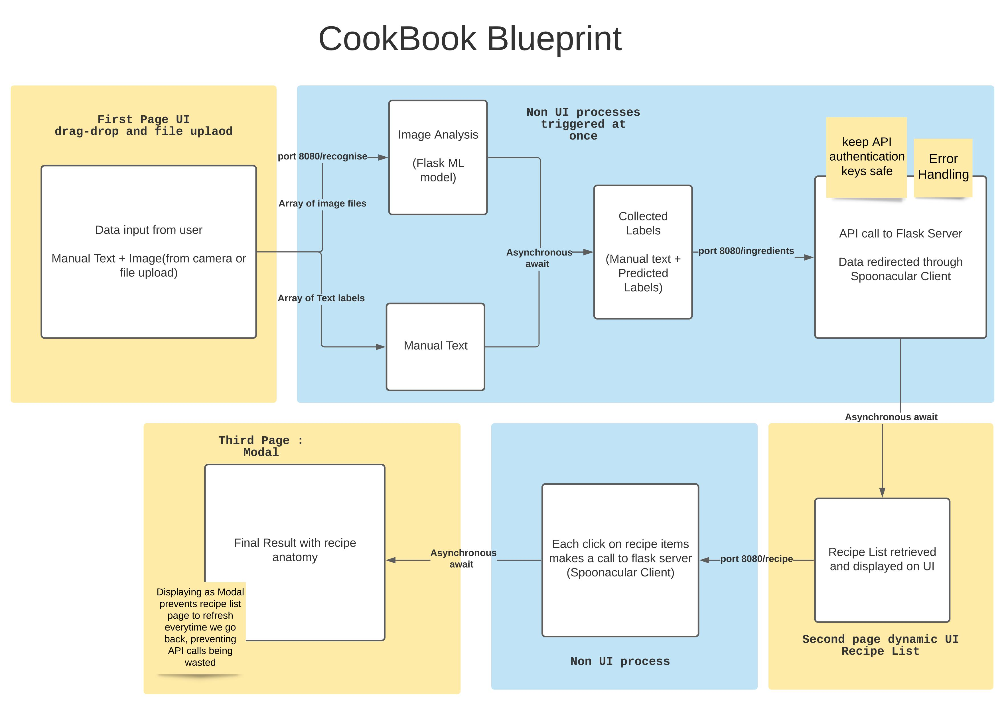
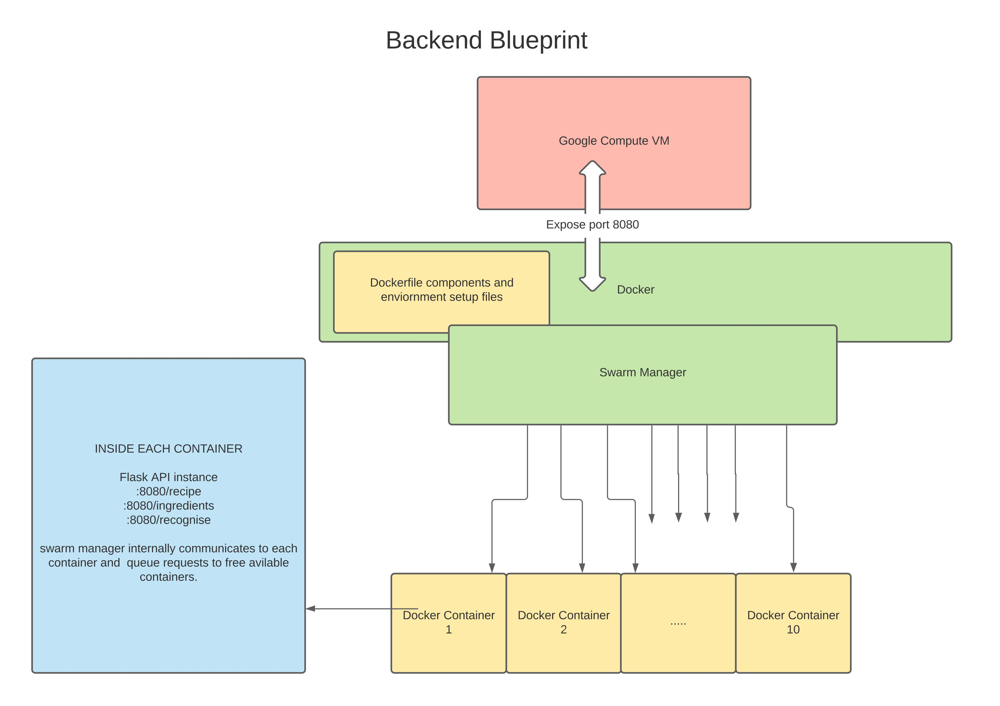
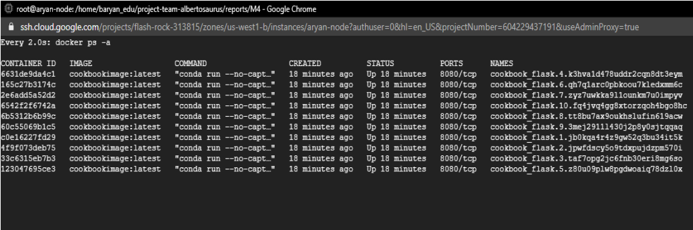
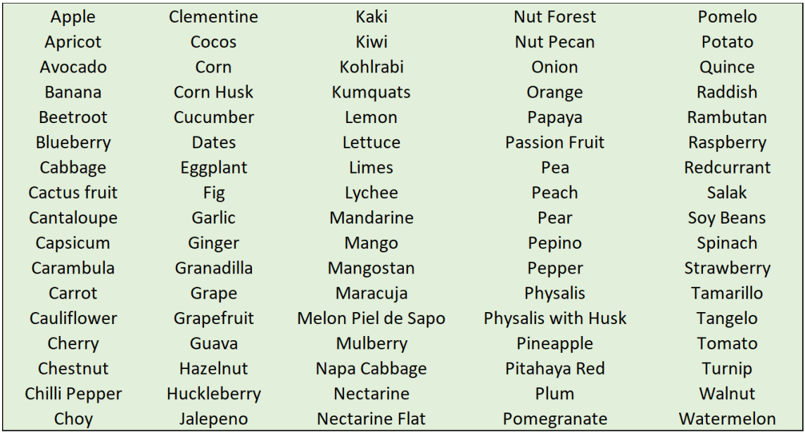

### Authors: 
#### (Source: [Final Report](/reports/final/CPEN291%20Final%20Report.pdf))

Aryan built the frontend web-app using ReactJS, remodeled it for android/ios display sizes, integrated spoonacular client with backend, automated cycling of API authentication keys, deployed the frontend on pm2 instance, created Cookbook service of the flask-app to be deployed on docker swarm containers and contributed for the flowcharts in the final report.

Jeremy created a machine learning model that was ultimately not picked for the final rendition of CookBook. He then focused on the secretarial side of things, such as the final report and the demo.

Ting created the final version of the machine learning model, embedded the trained model into Flask for the backend portion of the web app, completed both of the mobile apps, and helped explain her respective parts for the final report. 

Rushil worked on an earlier implementation of the Android app and helped with the final report.

# CookBook
It is a web and android app that takes in images of fruits and vegetables, uses a machine learning model to recognize them in the images, and then outputs various recipes that use them as ingredients. Users can either upload images from their computer, take an image straight from their camera, or type in the name of an ingredient. Each recipe’s anatomy can further be fetched to display the ingredients, instructions, prep time, serving size, wine-pairing, cuisine type and a link to the original source of the recipe. 

### Frontend : 
The web app was created using ReactJS and various npm libraries. Most tasks have been automated using multiple asynchronous calls and await functions. The frontend has been deployed as a single pm2 instance on google cloud server. 

The android app and ios app uses WebView and NSURLaddress respectively to load the URL address of the web app and change the display to be more mobile-friendly. The apps were created to enable the upload feature using camera 

  - #### Web App : 
    * [On a domain name (useless redirects, curse of free domains)](http://www.cookbookubc.ml/) 
  
    * [On GCP ip (stable)](http://35.212.227.131:3000/) 
  
  - #### Android App :
    * [Download](https://drive.google.com/file/d/1shGokn5KniK7JhM_rKz94i8go7QQag4N/view?usp=sharing)
  
  - #### IOS App :
    * [Download](https://www.pgyer.com/D8w5)

### Backend : 
The backend has been implemented using Flask and is responsible for handling all the requests sent to it via the frontend. It listens on port 8080 and has 3 major functionalities — load the model.pht file and predict incoming images (:8080/recognise), create a spoonacular client instance to fetch lists of recipes using the ingredients (:8080/ingredients), and finally make a call to retrieve the complete info about a specific recipe (:8080/recipe). 

The flask is deployed in multiple docker containers to parallelise the task. This was achieved using docker swarm handled by a manager node.
  * It can handle up to 10 simultaneous requests at once (current configured docker swarm as per optimal server configuration). This reduces the time to respond to concurrent API calls by 90%.
  * The downtime of our server was reduced by 99% in case of crashes or timeout error

### Machine Learning Model
We used MobileNetV2 as the architecture for the machine learning model. MobileNets are characterized by their fast inference since they are based on a streamlined architecture, using depth-wise separable convolutions to build light weight deep neural networks. MobileNetV2 features an inverted residual structure with a bottleneck between layers, which also removes non-linearities in the narrow layers. It also utilizes a novel framework known as SSDLite, which results in a prediction speed increase of up to 35% in comparison to previous versions. 

We trained two separate implementations of a model on a dataset that consists of datasets from Kaggle (Fruits360, a dataset of images of fruits taken from all around it, and Fruit and Vegetable Image Recognition, a dataset include 36 species, each with around 100 images), and images from Bing Image Search(using bbid) and Google Image Search(using webdriver and selenium library).

 

 
 
External Sources Credits : The images used on the webpages are for educational purposes only. Logos are self generated and most of the vectors,svg and gifs are free. Credits @ Google Images and various artistic creators
